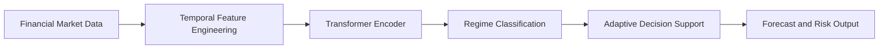

# Chapter 1: Introduction

## 1.1 Background

Financial markets are not governed by a single stationary pattern. Instead, they evolve through multiple latent states, including bullish, bearish, sideways, and high-volatility regimes. These states are associated with different return distributions, different risk levels, and different sensitivity to macroeconomic and behavioral shocks. A market model that is fitted on a pooled distribution across all states may appear statistically stable but can be strategically unreliable when the underlying state changes.

This problem is especially important in decision-support settings where financial institutions require accurate reasoning about change points, regime transitions, and risk exposure. The classical assumption that market relationships remain constant over time is unrealistic in practice. Non-stationarity, structural breaks, and volatility clustering are persistent characteristics of modern financial systems.

Transformer-based deep learning models have emerged as a strong candidate for time-series representation learning because they can model long-range dependencies without relying purely on recurrence. Unlike recurrent models that propagate information through hidden states, transformer encoders use self-attention to directly model relationships among time points and variables. This makes them especially relevant for financial applications where dependencies may span many time steps and where cross-feature interactions carry predictive value.

The present research addresses the need for a regime-aware financial decision-support framework that integrates temporal feature engineering, transformer attention, and adaptive classification. The central idea is that forecasts are more meaningful when the model first identifies the market regime and then conditions its decisions on that regime.

## 1.2 Problem Statement

The problem addressed in this thesis is the limited capability of conventional forecasting systems to operate effectively under market regime transitions. Most existing methods assume that the distribution of historical data remains stable during training and inference. This assumption often fails in finance because regimes shift in response to inflation cycles, liquidity stress, policy shocks, sectoral rotation, and global macroeconomic changes.

As a consequence, many models produce high-accuracy results on aggregate historical data but fail to maintain consistent usefulness when the market enters a new regime. In such cases, the model may misinterpret a transition as a continuation of a previous pattern, resulting in poor investment actions, inadequate hedging, or weak risk management.

The need for an adaptive market intelligence system is therefore urgent. The thesis proposes that explicit regime identification should be treated as a first-order problem rather than a secondary byproduct of forecasting.

## 1.3 Research Motivation

The motivation for this work is driven by four practical and theoretical observations.

1. Financial time series are strongly regime-dependent and non-stationary.
2. Deep transformers provide powerful sequence modeling and variable interaction representation.
3. Decision systems require more than point forecasts; they require adaptive reasoning under uncertainty.
4. The literature shows a persistent gap between high-capacity forecasting models and truly regime-aware decision support.

This research is motivated by the absence of a unified framework that combines regime recognition, attention-based temporal modeling, and decision support. Such a framework is suitable for real-world deployment in risk monitoring, portfolio allocation, and market signal interpretation.

## 1.4 Research Objectives

The specific objectives of the thesis are as follows:

1. To analyze how market regimes affect financial time-series behavior and decision quality.
2. To design a hybrid transformer-based framework for regime-aware forecasting and decision support.
3. To develop a reproducible pipeline for preprocessing, training, validation, and evaluation.
4. To compare the proposed methodology with standard baseline models using rigorous metrics.
5. To present the research in a form suitable for academic submission and future publication.

## 1.5 Research Questions

This thesis is guided by the following research questions:

1. What are the distinct statistical and structural signatures of different market regimes?
2. How can transformer attention be combined with engineered financial features to improve regime detection?
3. How does a regime-aware transformer architecture compare with classical and deep-learning baselines?
4. Can the proposed framework provide better adaptive decision support in changing market conditions?

## 1.6 Hypotheses

The main hypotheses of the research are as follows:

1. Explicit regime identification improves financial prediction reliability under non-stationary conditions.
2. A transformer-based model produces stronger representation learning than classical tabular models for temporal market patterns.
3. A hybrid regime-aware architecture yields better decision-support utility than a single-stage forecasting system.

## 1.7 Scope

The scope of the research is confined to the development and evaluation of a regime-aware transformer-based financial decision-support architecture. The study focuses on multivariate temporal signals derived from financial and market-extracted indicators. It evaluates the methodology using benchmark-style comparisons, robust validation, and standard classification and forecasting metrics.

The work is not intended to claim universal predictability of financial markets. Instead, it seeks a defensible contribution to the more realistic task of adaptive regime-aware decision support under uncertainty.

## 1.8 Limitations

This thesis acknowledges several important limitations:

- Market regimes are not directly observable and must often be inferred through proxy rules or structural assumptions.
- Financial datasets are subject to noise, survivorship bias, structural breaks, and reporting inconsistencies.
- Transformer models can be computationally intensive and sensitive to training configuration.
- The final conclusions are bounded by the selected market domain and evaluation setup.

These limitations are recognized as part of the research design and as normal constraints of empirical financial modeling.

## 1.9 Significance and Contributions

This thesis contributes to the literature in several ways.

1. It introduces a regime-aware perspective into financial decision support, moving beyond single-distribution forecasting.
2. It integrates transformer-based sequence representation with regime-aware classification in a unified framework.
3. It provides a reproducible implementation pipeline for scholarly and industrial reuse.
4. It offers a structured academic discussion of the research gap, methodology, and experimental implications.

## 1.10 Chapter Summary

Chapter 1 establishes the motivation, context, and problem statement for the thesis. It highlights the theoretical and practical need for regime-aware modeling in financial decision support and justifies the use of transformer-based sequence learning. The next chapter reviews the literature to identify the current foundations, advances, and unresolved research gaps that motivate the proposed methodology.
