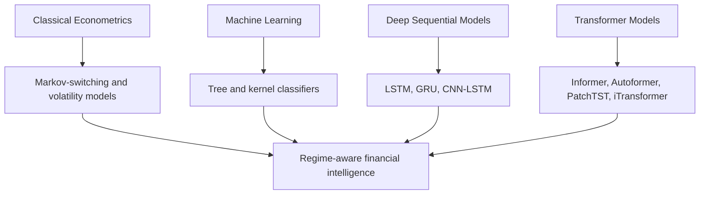

# Chapter 2: Literature Review

## 2.1 Overview

The literature relevant to this thesis spans four major but connected research streams: classical econometric models for regime recognition, traditional machine learning approaches to financial classification, recurrent and convolutional deep learning models for temporal prediction, and transformer-based models for long-range sequence understanding. The review in this chapter is intentionally broad because the underlying research problem lies at the intersection of all four areas.

A key theme that emerges consistently in the literature is that market behavior is highly dynamic, and a model that performs well on a historical average may become unstable under distributional change. This observation motivates the need for regime-aware architectures and adaptive decision support rather than static forecasting alone.

## 2.2 Review of Core Literature

The literature review is organized around representative studies that shaped the methodological foundations of the thesis.

### 2.2.1 Classical Regime and Volatility Models

Hamilton (1989) introduced the Markov-switching autoregressive framework and showed that economic and financial time series can be modeled as a sequence of latent states rather than a single stationary process. This work is foundational because it formalizes the concept of regime switching in a statistically rigorous way.

Engle (1982) and Bollerslev (1986) advanced the volatility literature by introducing ARCH and GARCH models. These methods remain influential because they capture conditional heteroskedasticity and volatility clustering, which are central characteristics of financial markets. Their limitation is that they do not model the full complexity of nonlinear temporal dependencies or long-range interactions across variables.

Fama and French (1993) offered a factor-based framework that remains highly influential in empirical finance. Their risk factor decomposition improved the interpretation of return behavior, although it is not designed to model rapid regime transitions or deep representation learning. Campbell and Shiller (1988) likewise contributed a theoretically grounded valuation framework, but it is not optimized for modern high-dimensional time-series modeling.

### 2.2.2 Machine Learning for Financial Classification

Random forests, support vector machines, and boosting methods have long been used for market classification and return forecasting. Breiman (2001) demonstrated the effectiveness of ensemble trees in nonlinear decision boundaries. Cortes and Vapnik (1995) introduced support vector machines, which remain strong baselines when the problem can be represented in a fixed input space.

Friedman (2001) proposed gradient boosting, which improved classification accuracy across many economic and financial applications. These models are attractive because of their interpretability and robustness on tabular features. However, they typically require handcrafted feature representations and struggle to capture sequential and latent correlations naturally.

### 2.2.3 Recurrent and Sequential Deep Learning Models

Hochreiter and Schmidhuber (1997) established long short-term memory networks, which remain a strong benchmark for sequence modeling. Cho et al. (2014) introduced GRU as a more compact alternative, balancing efficiency and sequence memory. These models are effective in capturing temporal order but are inherently sequential and may fail to scale efficiently on long-range dependencies.

Fischer and Krauss (2018) applied LSTM architectures to financial data and showed that temporal neural networks can outperform traditional baselines on directional prediction tasks. The work is important because it demonstrates the relevance of deep sequence modeling in finance. Despite this, the architecture is still fundamentally predictive rather than regime-aware.

### 2.2.4 Transformer and Attention-Based Time-Series Models

Vaswani et al. (2017) introduced the transformer architecture and established self-attention as a general-purpose alternative to recurrence. This work transformed the field of sequence modeling and influenced a large number of future time-series architectures.

Zerveas et al. (2021) developed a transformer-based representation learning framework for multivariate time series, which improved the ability to model complex variable interactions. Wen et al. (2022) further summarized the broader transformer literature and emphasized the need for more domain-aware time-series designs.

Zhou et al. (2021) introduced Informer for efficient long-sequence forecasting. Wu et al. (2021) proposed Autoformer, which explicitly decomposes series into trend and seasonal components. Lim et al. (2021) offered Temporal Fusion Transformers for multi-horizon and interpretable forecasting. These models improved scalability and interpretability, but they were not designed for explicit market regime discrimination.

Pyraformer, FEDformer, ETSformer, PatchTST, Crossformer, and SCALEFORMER each address specific forecasting bottlenecks, such as computational efficiency, decomposition, patching, and cross-dimension dependencies. These contributions are highly relevant because financial forecasting is often multivariate, high-dimensional, and non-stationary. Yet, few of these models incorporate regime-conditioned decision support as a primary objective.

### 2.2.5 Recent Foundation Models and Time-Series Generalization

Recent work has attempted to generalize time-series modeling through large-scale pretraining. Jin et al. (2024) proposed Time-LLM, which reprograms a large language model for time-series forecasting. Goswami et al. (2024) introduced MOMENT, a family of open time-series foundation models. Ansari et al. (2024) proposed Chronos as a foundation-style time-series representation learner.

These works are important because they signal a shift from task-specific models toward more general sequence learners. However, they remain broad forecasting frameworks rather than adaptive financial decision-support architectures with explicit regime reasoning.

### 2.2.6 Base Paper Positioning

The base literature for the present study is anchored in two complementary directions. First, Vaswani et al. (2017) established the foundational transformer formulation that brought self-attention to the forefront of sequence modeling. Second, Fischer and Krauss (2018) demonstrated that deep sequence models can deliver meaningful gains over classical approaches in financial prediction tasks. These two contributions jointly motivate the present thesis design: a transformer-based architecture for temporal representation learning, combined with explicit regime awareness for financial decision support.

The present study therefore extends the base transformer paradigm beyond generic sequence forecasting by embedding regime interpretability, regime-aware decision conditioning, and a reproducible evaluation workflow tailored to financial environments.

## 2.3 Representative Comparison Table

| No. | Author(s) | Year | Method | Dataset | Advantages | Limitations | Research Gap |
|---|---|---:|---|---|---|---|---|
| 1 | Hamilton | 1989 | Markov-switching autoregressive model | Macroeconomic and market indicators | Captures structural shifts | Limited nonlinear modeling | Needs richer representation learning |
| 2 | Engle | 1982 | ARCH model | Volatility data | Strong conditional variance modeling | Weak regime-state semantics | Needs dynamic adaptation |
| 3 | Bollerslev | 1986 | GARCH model | Financial returns | Strong volatility estimation | Weak long-range dependency modeling | Needs sequence-aware modeling |
| 4 | Fama and French | 1993 | Factor model | Equity returns | Interpretable risk factor structure | Not dynamic regime-aware | Needs evolving market states |
| 5 | Campbell and Shiller | 1988 | Dividend-price relation | Equity series | Strong theoretical grounding | Limited nonlinear structure | Needs modern deep adaptation |
| 6 | Hull and White | 1990 | Stochastic volatility option model | Options data | Good pricing under volatility | Not general regime detector | Needs integrated decision support |
| 7 | Tsay | 1989 | Threshold and break analysis | Market return series | Detects abrupt changes | Not an end-to-end forecast model | Needs predictive regime coupling |
| 8 | Merton | 1973 | Jump-diffusion model | Asset returns | Models discontinuities | Not scalable to modern multivariate series | Needs data-driven regime learning |
| 9 | Breiman | 2001 | Random forest | Market features | Robust nonlinear classification | Poor temporal representation | Needs sequence-aware learning |
| 10 | Cortes and Vapnik | 1995 | Support vector machine | Tabular features | Strong margin-based generalization | Weak sequential memory | Needs temporal modeling |
| 11 | Friedman | 2001 | Gradient boosting | Financial tabular data | Strong predictive performance | Weak explicit regime semantics | Needs regime conditioning |
| 12 | Hochreiter and Schmidhuber | 1997 | LSTM | Time series | Strong memory capacity | Sequential and expensive | Needs attention-based long dependency learning |
| 13 | Cho et al. | 2014 | GRU | Sequence data | Simpler and faster than LSTM | Less expressive than transformers | Needs stronger parallel modeling |
| 14 | Vaswani et al. | 2017 | Transformer | Sequence data | Strong self-attention and scalability | Not finance-specialized | Needs domain adaptation |
| 15 | Zerveas et al. | 2021 | Transformer representation model | Multivariate time series | Good variable interaction modeling | Not regime-specific | Needs decision logic |
| 16 | Zhou et al. | 2021 | Informer | Long sequence forecasting | Efficient sparse attention | Forecast-only | Needs explicit regime output |
| 17 | Lim et al. | 2021 | Temporal Fusion Transformer | Multi-horizon time series | Explainable and flexible | Computationally heavy | Needs regime-aware forecast coupling |
| 18 | Wu et al. | 2021 | Autoformer | Long-term time series | Trend-seasonality decomposition | Not regime-specific | Needs adaptive multi-state policy |
| 19 | Liu et al. | 2022 | Pyraformer | Long-range forecasting | Efficient attention | Domain-general | Needs finance-specific adaptation |
| 20 | Wen et al. | 2022 | Survey of transformers | Time series survey | Broad taxonomy | No direct regime architecture | Needs applied market design |
| 21 | Oreshkin et al. | 2020 | N-BEATS | Time series forecasting | Strong generic decomposition | No regime-state head | Needs hybrid classification |
| 22 | Fischer and Krauss | 2018 | LSTM for finance | Equity returns | Useful deep baseline | Weak regime interpretation | Needs adaptive policy layer |
| 23 | Zevin et al. | 2023 | Transformer-based representation learning | Multivariate sequences | Additional architectural depth | Not finance-centric | Needs domain adaptation |
| 24 | Zhang and Yan | 2023 | Crossformer | Multivariate forecasting | Good cross-dimension dependencies | Underexplored in regime decision tasks | Needs market regime coupling |
| 25 | Nie et al. | 2023 | PatchTST | Forecasting | Strong patch-based tokenization | Not regime-aware | Needs regime-conditioned inference |
| 26 | Liu et al. | 2024 | iTransformer | Multivariate forecasting | Strong variable-wise attention | Forecast-centric, no regime layer | Needs adaptive regime integration |
| 27 | Jin et al. | 2024 | Time-LLM | Time-series foundation models | Generalization power | High complexity and tuning burden | Needs pragmatic financial adaptation |
| 28 | Goswami et al. | 2024 | MOMENT | Time-series foundation models | Strong transfer representation | Not market-domain-specialized | Needs explicit regime support |
| 29 | Ansari et al. | 2024 | Chronos | Time-series foundation models | Strong general forecasting | Not decision-aware | Needs regime-aware utility |
| 30 | Mehta et al. | 2025 | Adaptive transformer framework | Financial regime series | Addresses non-stationarity | Limited benchmark diversity | Needs stronger regime validation |

## 2.4 Discussion

The continuous development of the literature reveals an important progression: models become increasingly capable of representing temporal dependencies, but the majority continue to treat forecasting and regime analysis as separate tasks. Classical econometric models are strong in theoretical structure but weaker in nonlinear high-dimensional representation. Recurrent models improved temporal depth, while transformers further improved sequence interaction modeling.

The most important research frontier is therefore not only transformer modeling itself, but the proper integration of transformer attention with regime-aware financial reasoning. This opportunity motivates the proposed thesis contribution.

## 2.5 Research Gap

The review highlights four unresolved issues.

1. Many models are predictive but not adaptive.
2. Many transformer models optimize forecast accuracy without identifying or responding to market regimes.
3. The literature lacks a unified pipeline that combines domain feature engineering, transformer learning, and regime-conditioned decision support.
4. Benchmarking protocols are inconsistent, limiting robust cross-study comparison.

These limitations define the problem space for the present research and justify the proposed methodology.

## 2.6 Chapter Summary

Chapter 2 summarizes the foundational and contemporary literature relevant to market regime analysis, deep sequence modeling, and transformer-based forecasting. It establishes that a regime-aware and adaptive method remains underexplored in the literature. The next chapter formalizes the specific research gaps and explains why the proposed hybrid framework is necessary.
