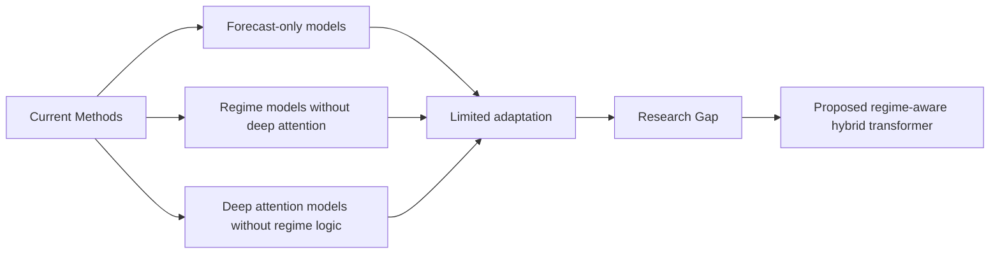

# Chapter 3: Research Gap

## 3.1 Introduction

The literature review in Chapter 2 establishes a strong foundation in temporal forecasting, regime switching, and transformer modeling. However, the review also reveals that these methodological advances have not been fully integrated into a single adaptive framework for financial decision support. The key issue is not simply whether a model can forecast a price change; rather, it is whether the model can identify a market state and then adaptively support decisions under a changing state sequence.

This chapter formalizes the specific research gap and explains why existing approaches remain insufficient for practical financial intelligence.

## 3.2 Identification of Research Gaps

### Gap 1: Absence of explicit regime awareness in forecasting pipelines

Most existing forecasting systems are trained on a pooled distribution and assume that the market behaves according to a single mapping over time. This assumption is incompatible with the observed behavior of real financial markets, which evolve through unstable and heterogeneous regimes. The consequence is that models may achieve strong average performance while being strategically weak in state transitions.

### Gap 2: Weak integration of attention and domain semantics

Transformer models have advanced sequence modeling substantially, but many attention-based systems are used as generic forecasting engines rather than regime-aware financial analysts. In other words, the model learns contextual dependencies without explicitly separating market states or incorporating the interpretive semantics of financial regimes.

### Gap 3: Limited decision-support capability under non-stationarity

Forecasting alone is rarely sufficient for real financial use. Decision support requires information about the current market regime, the likely transition behavior, and the associated risk posture. The current literature often stops at prediction or classification without linking the prediction to an adaptive operational response.

### Gap 4: Inconsistent benchmarking and low reproducibility

The literature shows a wide range of model families, data windows, labels, and evaluation protocols. This inconsistency makes it difficult to compare results across studies and weakens confidence in practical transferability. For a field as sensitive to data dependency as finance, benchmark clarity and reproducibility are crucial.

## 3.3 Why Current Methods Are Insufficient

Existing methods are insufficient for the following reasons.

1. They assume temporal homogeneity even though market transitions are discontinuous and state-dependent.
2. They often treat prediction and regime understanding as separate tasks rather than integrated learning objectives.
3. They rarely condition downstream decision support on regime uncertainty or transition probability.
4. They do not consistently provide a reproducible, modular pipeline that can be validated across market conditions.

These limitations create a methodological gap between theoretical sequence modeling and operationally useful market intelligence.

## 3.4 Why the Proposed Work Is Necessary

The proposed research is necessary to overcome these limitations by building a framework that does not merely predict returns but explicitly models regime structure. The method is designed to exploit the strengths of transformers while retaining practical decision usefulness. Rather than treating the market as a single sequence with one latent pattern, the model assumes several market states and learns how to identify them from temporal and engineered financial information.

The proposed architecture addresses the research gap through three integrated components:

- a temporal feature representation that captures volatility, trend, and momentum structure,
- a transformer encoder that models long-range and cross-variable dependencies,
- a regime-aware decision layer that conditions the output on current market state.

This combination is more aligned with the requirements of realistic financial decision support than standard forecasting-only architectures.

## 3.5 How the Proposed Work Addresses the Gaps

The proposed thesis addresses each gap in a direct manner.

- It treats regime identification as a core component of the learning system rather than a downstream interpretation.
- It integrates attention-based temporal encoding with engineered market signals and a classification objective.
- It provides a decision-support orientation that is more useful than outputting a single forecast value.
- It emphasizes reproducibility through modular code organization, clear preprocessing steps, and standard evaluation baselines.

In sum, the proposed methodology is intended to reduce the mismatch between powerful sequence models and the actual requirements of adaptive financial intelligence.

## 3.6 Chapter Summary

Chapter 3 formalizes the research problem by identifying the unresolved gaps in the literature and explaining why existing models are insufficient for practical decision support under changing market conditions. The next chapter presents the proposed methodology that directly addresses these shortcomings through a hybrid regime-aware transformer design.
