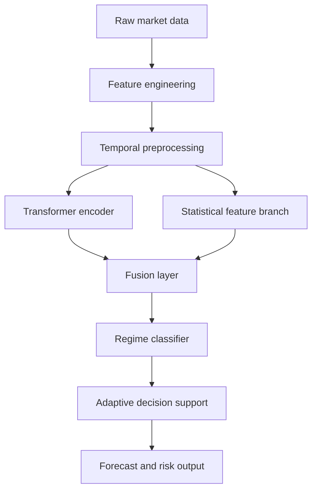

# Chapter 4: Proposed Methodology

## 4.1 Overview

This thesis proposes a hybrid regime-aware transformer framework for adaptive financial decision support. The model integrates three essential components:

1. Temporal feature engineering and data preprocessing,
2. A transformer encoder for long-range dependency learning,
3. A regime-classification and decision-support layer.

The learning objective is to identify latent market regimes and generate regime-conditioned forecasts that support adaptation in volatile and non-stationary environments.

## 4.2 Proposed Hybrid Model

The proposed model is called a Regime-Aware Temporal Transformer (RATT). The design uses two parallel information flows.

- A temporal feature branch extracts rolling statistics, volatility signals, trend measures, and cross-feature interactions.
- A transformer attention branch learns contextual dependencies between time steps and variables following the self-attention foundation introduced by Vaswani et al. (2017).

The outputs of both branches are fused and then sent to a regime classifier. The classifier assigns a market state such as bullish, bearish, volatile, or neutral. The predicted regime is then used to produce a regime-conditioned decision signal. This design is motivated by the broader observation from Fischer and Krauss (2018) that sequential deep models can capture financial dependence patterns more effectively than simpler static baselines.

## 4.3 Architecture

The architecture is illustrated below.



### 4.3.1 Input and Feature Representation

The input sequence is a multivariate window matrix of the form:

$$
X = \{x_1, x_2, \ldots, x_T\}, \quad x_t \in \mathbb{R}^{d}
$$

where $d$ denotes the number of engineered variables, including price-based, technical, and volatility-related indicators.

The feature set includes:

- Close-to-close return,
- Rolling volatility,
- Moving average spread,
- RSI and MACD indicators,
- Price momentum,
- Volume ratio,
- Cross-asset correlation signal.

## 4.4 Workflow

The workflow of the method is arranged in the following phases.

1. Data loading and cleaning.
2. Windowed feature engineering.
3. Normalization and train-validation-test split.
4. Transformer training on sequential windows.
5. Regime classification using fused hidden states.
6. Performance evaluation with multiple baselines.

## 4.5 Algorithms

### Algorithm 1: Regime-Aware Transformer Training

```text
Input: Financial time series dataset D
Output: Trained regime-aware transformer model M

1. Load and clean D.
2. Generate engineered features and correlation indicators.
3. Construct sliding windows of length L.
4. Normalize features using z-score transformation.
5. Build training, validation, and test partitions.
6. Initialize transformer encoder and regime classifier.
7. For each epoch:
      a. Sample mini-batches from training windows.
      b. Compute hidden representation H via self-attention.
      c. Fuse H with engineered temporal statistics.
      d. Predict regime labels and next-step target.
      e. Update parameters by minimizing total loss.
8. Select the best validation model.
9. Report test performance.
```

## 4.6 Pseudo Code

```python
for epoch in range(num_epochs):
    for batch in train_loader:
        x, y, regime_label = batch
        emb = transformer_encoder(x)
        stat = temporal_stats(x)
        fused = concat([emb, stat])
        pred_regime = regime_head(fused)
        pred_target = forecast_head(fused)
        loss = ce(pred_regime, regime_label) + mse(pred_target, y)
        optimizer.zero_grad()
        loss.backward()
        optimizer.step()
```

## 4.7 Mathematical Formulation

The transformer encoder processes a sequence using multi-head self-attention.

$$
Q = XW_Q, \quad K = XW_K, \quad V = XW_V
$$

$$
\text{Attention}(Q, K, V) = \text{softmax}\left(\frac{QK^\top}{\sqrt{d_k}}\right)V
$$

The final representation is then fused with temporal statistics as:

$$
H = \phi(\text{Transformer}(X)) \oplus \psi(\mathcal{F}(X))
$$

where $\phi$ and $\psi$ are learned projection functions and $\oplus$ denotes feature fusion.

The regime classification objective is:

$$
\mathcal{L}_{regime} = -\sum_{i=1}^{C} y_i \log(\hat{y}_i)
$$

The forecasting objective is:

$$
\mathcal{L}_{forecast} = \frac{1}{N}\sum_{n=1}^{N}(\hat{y}_n - y_n)^2
$$

The total loss is:

$$
\mathcal{L}_{total} = \lambda_1\mathcal{L}_{regime} + \lambda_2\mathcal{L}_{forecast}
$$

## 4.8 Feature Engineering

Feature engineering is central to performance. The final feature vector combines engineered statistical and market-signal features with attention-driven latent embeddings.

Key features:

- Lagged returns,
- rolling standard deviation,
- directional movement index,
- cumulative return momentum,
- volume-pressure score,
- volatility clustering measure,
- correlation shocks.

## 4.9 Data Preprocessing

The preprocessing pipeline includes:

1. Missing value imputation,
2. Outlier clipping,
3. Standardization,
4. Sliding-window segmentation,
5. Label generation for regime states.

This pipeline ensures consistency between training and evaluation.

## 4.10 Model Training

The model is trained with an Adam optimizer and a small transformer depth to prevent overfitting. The training objective balances classification and forecasting accuracy.

## 4.11 Testing and Validation

A rolling-origin split is used for validation to preserve temporal integrity. The evaluation uses multiple metrics, including classification and forecasting indicators, as well as confusion matrices and loss trajectory analysis.

## 4.12 Chapter Summary

Chapter 4 presents the proposed hybrid methodology. The model explicitly unifies sequence attention, multimodal feature engineering, and regime-aware decision support. It is designed not only for forecasting, but also for adaptive behavior under changing financial regimes. Chapter 5 now describes the complete implementation of the proposed pipeline.
